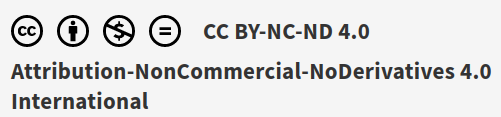

\pagebreak

> Estos apuntes se han realizado para los alumnos de 2º de Ciclo Superior de Desarrollo de Aplicaciones Multiplataforma.

---

Este documento se encuentra bajo una licencia Creative Commons de Atribución-CompartirIgual (CC BY-SA). 

Esto significa que puedes:

- Compartir: copiar y redistribuir el material en cualquier medio o formato.
- Adaptar: remezclar, transformar y construir sobre el material para cualquier propósito, incluso comercialmente.

Bajo las siguientes condiciones:

- Atribución: debes dar crédito de manera adecuada, proporcionar un enlace a la licencia e indicar si se han realizado cambios. Puedes hacerlo de cualquier manera razonable, pero no de una manera que sugiera que el licenciante te respalda a ti o al uso que hagas del trabajo.
- Compartir igual: si remezclas, transformas o creas a partir del material, debes distribuir tus contribuciones bajo la misma licencia que el original.

Para más detalles, consulta la [licencia completa](https://creativecommons.org/licenses/by-sa/4.0/legalcode.es).

---

> Para una versión actualizada de este libro visita esta Web: <https://gitlab.iesvirgendelcarmen.com/juangu/tema05-spring-web-zapapp>.

\pagebreak
\tableofcontents
\pagebreak

# ZapApp Spring Web 

Spring Java nos permite desarrollar aplicaciones de manera más rápida, eficaz y corta, saltándonos tareas repetitivas y ahorrándonos lineas de código. En este proyecto vamos a desarrollar una aplicación Web que es una Zapatería online con Spring Boot.

Concretamente vamos a hacer uso de Spring Data y Spring JPA que internamente usan herramientas ORM pero simplifican aún más ofreciendo otra capa más de abstracción.

\pagebreak

# Herramientas ORM

Una herramienta ORM (Object-Relational Mapping) es una tecnología o biblioteca que permite mapear objetos de una aplicación orientada a objetos a tablas en una base de datos relacional. Proporciona una capa de abstracción entre la base de datos y el código de la aplicación, permitiendo que los desarrolladores trabajen con objetos y clases en lugar de tener que escribir consultas SQL directamente.

El objetivo principal de una herramienta ORM es simplificar y agilizar el desarrollo de aplicaciones al eliminar la necesidad de escribir consultas SQL manualmente y manejar la interacción con la base de datos de manera transparente. Al utilizar una herramienta ORM, los desarrolladores pueden modelar las entidades de su aplicación como clases en lenguajes de programación orientados a objetos como Java, C#, Python, etc., y luego utilizar métodos y consultas específicas del ORM para interactuar con la base de datos.

Algunas de las funciones y características comunes proporcionadas por las herramientas ORM incluyen:

1. Mapeo objeto-relacional: Las herramientas ORM mapean automáticamente las propiedades de las clases a las columnas de la base de datos y viceversa. Esto permite que los objetos se almacenen, se recuperen y se actualicen en la base de datos de manera transparente sin necesidad de escribir consultas SQL manualmente.

2. Generación de consultas SQL: Las herramientas ORM generan automáticamente las consultas SQL necesarias para realizar operaciones CRUD (Crear, Leer, Actualizar, Eliminar) en la base de datos a partir de las operaciones realizadas en las entidades de la aplicación.

3. Administración de transacciones: Las herramientas ORM proporcionan mecanismos para administrar transacciones en la base de datos. Esto garantiza la integridad y consistencia de los datos al permitir que las operaciones se realicen en forma atómica (todo o nada) y se deshagan automáticamente si se produce un error.

4. Caché de objetos: Las herramientas ORM a menudo incluyen un mecanismo de caché de objetos para mejorar el rendimiento y reducir las consultas a la base de datos. Esto permite almacenar en memoria los objetos recuperados de la base de datos para un acceso más rápido en futuras operaciones.

5. Consultas avanzadas y optimizaciones: Las herramientas ORM suelen ofrecer funciones avanzadas para realizar consultas complejas, consultas personalizadas y optimizaciones de rendimiento, como la carga ansiosa (eager loading) y la recuperación diferida (lazy loading) de datos.

Algunas de las herramientas ORM populares son Hibernate (para Java), Entity Framework (para .NET), Django ORM (para Python), Sequelize (para JavaScript/Node.js), entre otras. Estas herramientas ofrecen una abstracción poderosa y simplificada para trabajar con bases de datos relacionales, mejorando la productividad del desarrollo y facilitando el mantenimiento del código.

## Spring Data JPA

Spring en sí mismo no es una herramienta ORM, pero ofrece integraciones y soporte para varias herramientas ORM populares como Hibernate, JPA (Java Persistence API) y MyBatis.

Spring Data JPA es uno de los módulos de Spring que proporciona una capa de abstracción adicional sobre JPA, simplificando aún más el desarrollo de aplicaciones ORM en Java. Spring Data JPA combina la potencia de JPA con las características y funcionalidades adicionales de Spring, como la inyección de dependencias, la administración de transacciones y el manejo de excepciones.

Al utilizar Spring Data JPA, puedes aprovechar las anotaciones de mapeo de entidades, las consultas JPA, la administración de transacciones y otras funcionalidades proporcionadas por JPA para interactuar con la base de datos. Spring Data JPA también ofrece características adicionales, como la generación automática de consultas, consultas personalizadas basadas en convenciones de nomenclatura y soporte para paginación y clasificación de resultados.

Además de Spring Data JPA, Spring Framework en general proporciona soporte para la configuración y administración de transacciones, lo que facilita la integración con diversas herramientas ORM. Spring también ofrece capacidades de caché a través del módulo Spring Cache, que se puede utilizar en combinación con una herramienta ORM para mejorar el rendimiento de las consultas y la recuperación de datos.

## Spring MVC

Spring MVC (Model-View-Controller) es un framework de desarrollo web basado en el patrón de diseño MVC. Proporciona una estructura para el desarrollo de aplicaciones web en Java, donde el flujo de ejecución se divide en tres componentes principales: modelo, vista y controlador.

El patrón de diseño MVC separa la lógica de la aplicación en tres componentes distintos:

* Modelo (Model): Representa los datos y la lógica de negocio de la aplicación. El modelo encapsula la información y proporciona métodos para acceder, actualizar y manipular los datos. También puede contener la lógica para validar los datos y realizar operaciones relacionadas con la lógica del dominio.
* Vista (View): Es la representación visual de los datos del modelo. La vista es responsable de la presentación y el formato de los datos que se muestran al usuario. Puede ser una página HTML, una plantilla, una interfaz de usuario o cualquier otro medio para mostrar la información al cliente.
* Controlador (Controller): Actúa como intermediario entre el modelo y la vista. Recibe las solicitudes del cliente, interactúa con el modelo para procesar los datos y determina la vista adecuada para presentar la respuesta al usuario. El controlador maneja las solicitudes HTTP, invoca métodos del modelo y selecciona la vista apropiada para generar la respuesta.

Spring MVC se basa en este patrón y proporciona una implementación flexible y escalable para el desarrollo de aplicaciones web en Java. Algunas características y beneficios de Spring MVC incluyen:

* Separación clara de responsabilidades: La arquitectura basada en MVC permite una separación clara de las responsabilidades, lo que facilita el mantenimiento, la reutilización y la prueba de las diferentes capas de la aplicación.
* Configuración flexible: Spring MVC se configura mediante anotaciones, archivos XML o Java, lo que brinda flexibilidad en la configuración de las rutas, los controladores, las vistas y otros aspectos de la aplicación.
* Integración con otros componentes de Spring: Spring MVC se integra de manera natural con otros componentes del ecosistema de Spring, como Spring Boot, Spring Data, Spring Security, entre otros.
* Soporte para pruebas unitarias: Spring MVC proporciona herramientas y APIs para facilitar las pruebas unitarias de los controladores, lo que permite una prueba eficaz de la lógica de la aplicación y la interacción con el modelo y las vistas.

## Para ampliar...

Si quieres aprender más sobre el proyecto Spring, o Spring Framework, puedes visitar su Web <https://spring.io/>. 

Spring es un proyecto de código abierto que abarca una amplia gama de tecnologías y componentes para el desarrollo de aplicaciones empresariales en Java. Proporciona una plataforma completa y coherente para el desarrollo de aplicaciones, abordando diferentes aspectos como la creación de aplicaciones web, la administración de transacciones, la integración con bases de datos, la seguridad, la programación orientada a aspectos y mucho más.

Por desgracia en este curso no tenemos tiempo de ver completamente Spring, pero estos son algunos de los principales componentes y características:

* **Inversión de control (IoC)**: Spring hace uso extensivo del patrón de diseño Inversión de Control (IoC), también conocido como Inyecci# ZapApp Spring Web 

Spring Java nos permite desarrollar aplicaciones de manera más rápida, eficaz y corta, saltándonos tareas repetitivas y ahorrándonos lineas de código. En este proyecto vamos a desarrollar una aplicación Web que es una Zapatería online con Spring Boot.ón de Dependencias (DI). Esto permite que los objetos sean creados y administrados por el contenedor de Spring, en lugar de que las clases creen y administren sus propias dependencias. Esto promueve una arquitectura más modular y facilita la prueba unitaria y la reutilización de componentes.
* **Spring MVC**: Es el módulo de Spring para el desarrollo de aplicaciones web basadas en el patrón Modelo-Vista-Controlador (MVC). Proporciona una estructura y conjunto de clases para construir fácilmente aplicaciones web, manejar solicitudes HTTP, administrar formularios, realizar validaciones, manejar sesiones, y mucho más.
* **Persistencia de datos**: Spring ofrece soporte para el acceso y la persistencia de datos mediante diferentes tecnologías y herramientas ORM como Hibernate, JPA, MyBatis y JDBC. Spring Data es un subproyecto de Spring que simplifica aún más el desarrollo de capas de persistencia mediante la generación automática de consultas, la gestión de transacciones y la integración con diversas bases de datos.
* **Seguridad**: Spring Security es otro módulo clave de Spring que proporciona funciones y herramientas para la implementación de la seguridad en aplicaciones web y de servicios. Ofrece autenticación y autorización, protección contra ataques, gestión de sesiones y más.
* **Integración**: Spring facilita la integración con otras tecnologías y sistemas mediante el soporte de numerosos protocolos y estándares, como SOAP, REST, JMS, RMI, entre otros. También ofrece integración con frameworks y bibliotecas populares, como Apache Kafka, RabbitMQ, Apache Solr, entre otros.
* **Programación orientada a aspectos (AOP)**: Spring ofrece soporte para la programación orientada a aspectos, lo que permite modularizar aspectos transversales de una aplicación, como la seguridad, la auditoría y el manejo de transacciones, separándolos del código principal y promoviendo una mejor separación de preocupaciones.
* Spring tiene como objetivo proporcionar una plataforma sólida y flexible para el **desarrollo de aplicaciones empresariales** en Java, simplificando tareas comunes, promoviendo las mejores prácticas y fomentando la modularidad y la reutilización de componentes.

\pagebreak
