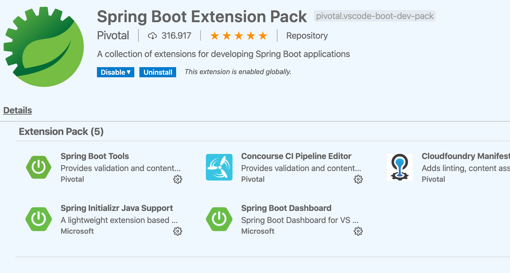
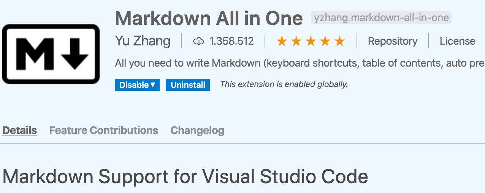
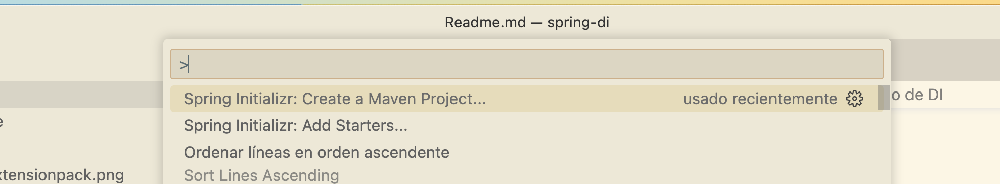
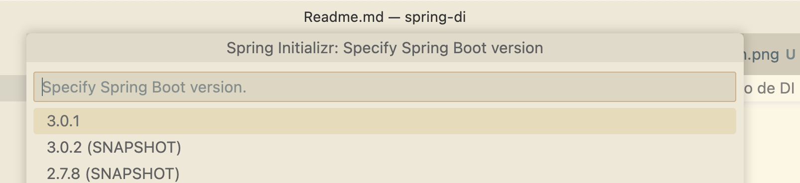
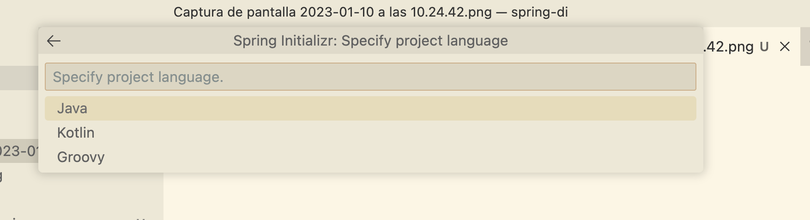
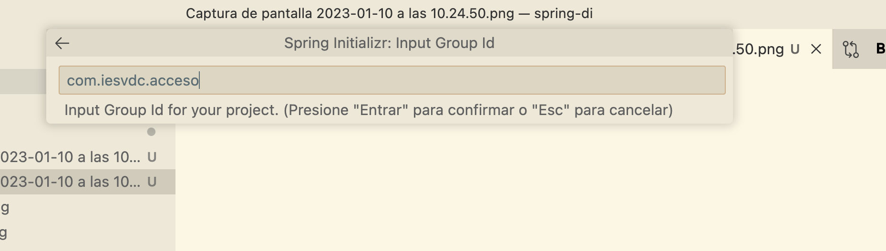
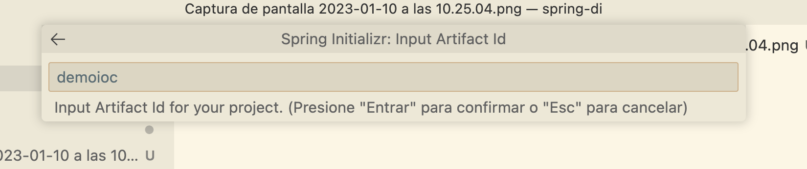
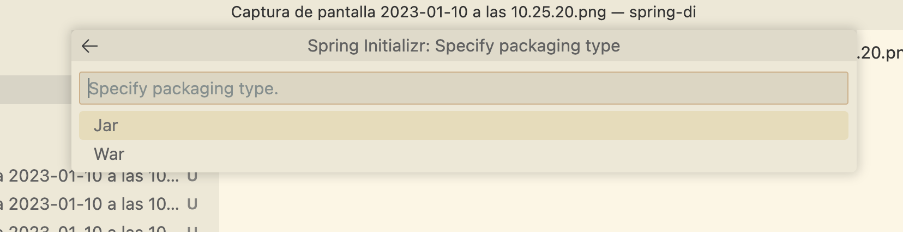
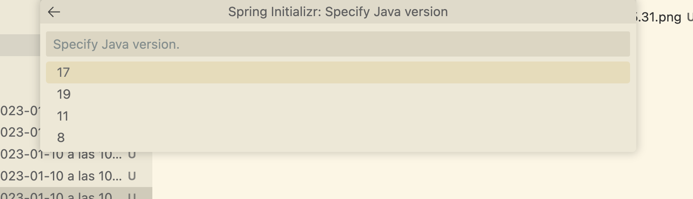
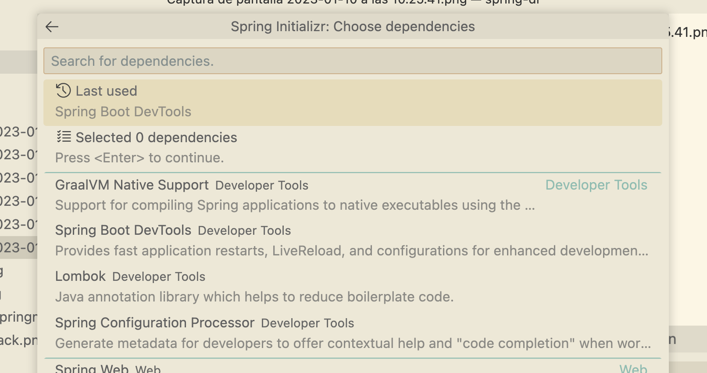

# Calentando el plato

En el argot de los programadores llamamos calentar el plato al tiempo que perdemos en hacer tareas repetitivas pero necesarias a la hora de empezar un nuevo proyecto.

## Prerrequisitos

Necesitamos tener instalada una [JDK](http://jdk.java.net/21/) y [Maven](http://maven.apache.org) en el equipo y accesible en la variable PATH del sistema operativo. Dependiendo del sistema operativo, es posible instalarlos desde las diferentes herramientas (ej. apt en Debian, brew en MAC....) sin tener que buscar en Internet.

Vamos a trabajar con VisualStudio Code y necesitamos tener instalados los plugins que veremos más adelante:

**Java Extension Pack**

**Spring boot Extension Pack**

**Markdown All in One**

## Puntos clave de Spring

* **Inversion de Control (IoC)**: básicamente de lo que se trata es de invertir la forma en que se controla la aplicación, lo qué antes dependía del programador, una secuencia de comandos desde alguno de nuestros métodos, ahora depende completamente del framework, con la idea de crear aplicaciones más complejas y con funcionamientos más automáticos.
* **Inyección de dependencia (DI)**: el manejo de las propiedades de un objeto son inyectadas a través de un constructor, un setter, un servicio, etc. 

## Creación del proyecto tipo

Para la creación del proyecto nos vamos a la paleta de comandos y cremos un proyecto Spring con Maven:

Al pulsar **enter** podemos seleccionar la versión de Spring boot que queremo usar, seleccionamos la última en nuestro caso.

Seguidamente seleccionamos el lenguaje de programación que queremos usar, en nuestro caso nos decantamos por Java:

Ya podemos indicar el grupo (paquete) donde va a estar nuestra aplicación:

Tras el paquete, hay que introducir el nombre de nuestro artefacto (aplicación):

Luego el tipo de empaquetado, como es una aplicación Spring Boot usaremos **JAR**, pues no necesitamos un servidor de aplicaciones, lleva embebido un Tomcat:

A continuación seleccionamos la versión de Java, donde selecionaremos 17 por ser la última LTS liberada a día de hoy:

En este proyecto *tonto* no necesitamos añadir ninguna dependencia a nuestro proyecto Maven, así que simplemente pulsamos enter en la selección de las mismas:

## Añadiendo Starters a Spring Initializr

Cuando creamos un proyecto Maven con Spring, podemos añadir diferentes dependencias de manera nativa que ayudarán en la confección de nuestro proyecto. Veamos las que vamos a usar para nuestro ejemplo en concreto.

### Devtools

Spring reinicia el programa en ejecución cada vez que hay un cambio en el disco (cuando pulsamos CTRL+S). Cuidado si tienes activado el autoguardado en tu IDE porque puede dar problemas.

### Spring JPA

Para las anotaciones de las clases entidad (modelo).

### Mysql Driver

Necesario para conectar a MySQL.

### Lombok

Un clásico en los proyectos con clases modelo (los llamados POJO o Plain Old Java Objects).

Lombok automatiza la tarea de añadir todos los constructores, getters, setters, etc. a nuestras clases modelo.

\pagebreak 