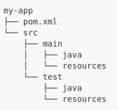

# Calentando el plato

En el argot de los programadores llamamos calentar el plato al tiempo que perdemos en hacer tareas repetitivas pero necesarias a la hora de empezar un nuevo proyecto.

## Prerrequisitos

Necesitamos tener instalada una [JDK](http://jdk.java.net/21/) y [Maven](http://maven.apache.org) en el equipo y accesible en la variable PATH del sistema operativo. Dependiendo del sistema operativo, es posible instalarlos desde las diferentes herramientas (ej. apt en Debian, brew en MAC....) sin tener que buscar en Internet.

Vamos a trabajar con VisualStudio Code y necesitamos tener instalados los plugins que veremos más adelante:

**Java Extension Pack**


**Spring boot Extension Pack**


**Markdown All in One**


## Puntos clave de Spring

* **Inversion de Control (IoC)**: básicamente de lo que se trata es de invertir la forma en que se controla la aplicación, lo qué antes dependía del programador, una secuencia de comandos desde alguno de nuestros métodos, ahora depende completamente del framework, con la idea de crear aplicaciones más complejas y con funcionamientos más automáticos.
* **Inyección de dependencia (DI)**: el manejo de las propiedades de un objeto son inyectadas a través de un constructor, un setter, un servicio, etc. 

## Maven

**Maven** es una herramienta de gestión y construcción de proyectos desarrollada por Apache Software Foundation. Es particularmente popular en el ecosistema Java por su capacidad para gestionar dependencias, automatizar procesos de compilación, pruebas, y despliegue, y por ofrecer una estructura de proyecto estandarizada.

### Principales Características de Maven

1. **Gestión de Dependencias**:
   Maven facilita la inclusión de bibliotecas y frameworks externos en el proyecto a través de su repositorio central y otros repositorios públicos o privados. Las dependencias se declaran en un archivo `pom.xml` (Project Object Model), y Maven se encarga de descargarlas y agregarlas al proyecto.

2. **Estandarización del Proyecto**:
   Maven impone una estructura estándar de directorios y archivos, lo que hace más fácil para los desarrolladores entender y navegar por el proyecto. La estructura básica de un proyecto Maven se ve así:

   

3. **Ciclo de Vida de Construcción**:
   Maven define un ciclo de vida de construcción estándar que incluye fases como `validate`, `compile`, `test`, `package`, `verify`, `install`, y `deploy`. Estas fases permiten automatizar y estandarizar el proceso de construcción del proyecto.

4. **Plugins**:
   Maven es altamente extensible mediante el uso de plugins. Cada fase del ciclo de vida de construcción puede tener plugins asociados que realizan tareas específicas, como compilación de código, ejecución de pruebas, generación de documentación, etc.

5. **Reusabilidad y Mantenimiento**:
   Con la gestión de dependencias y la estructura estandarizada, Maven facilita la reusabilidad de componentes y hace más sencillo el mantenimiento y actualización de proyectos.

### ¿Cómo Funciona Maven?

1. **Archivo POM (Project Object Model)**:
   El corazón de cualquier proyecto Maven es el archivo `pom.xml`. Este archivo contiene información sobre el proyecto y su configuración, incluyendo las dependencias, plugins, y otras configuraciones necesarias para construir y gestionar el proyecto.

   Ejemplo de un archivo `pom.xml` básico:

   ```xml
   <project xmlns="http://maven.apache.org/POM/4.0.0"
            xmlns:xsi="http://www.w3.org/2001/XMLSchema-instance"
            xsi:schemaLocation="http://maven.apache.org/POM/4.0.0 http://maven.apache.org/xsd/maven-4.0.0.xsd">
       <modelVersion>4.0.0</modelVersion>

       <groupId>com.example</groupId>
       <artifactId>my-app</artifactId>
       <version>1.0-SNAPSHOT</version>

       <dependencies>
           <dependency>
               <groupId>org.springframework.boot</groupId>
               <artifactId>spring-boot-starter-web</artifactId>
               <version>2.5.4</version>
           </dependency>
       </dependencies>
   </project>
   ```

2. **Repositorios**:
   Maven descarga las dependencias desde repositorios. El repositorio central de Maven es el más utilizado, pero también se pueden configurar otros repositorios.

3. **Comandos de Maven**:
   Maven se utiliza desde la línea de comandos con diversos comandos, como:
   - `mvn clean`: Limpia los archivos generados de la compilación anterior.
   - `mvn compile`: Compila el código fuente del proyecto.
   - `mvn test`: Ejecuta las pruebas unitarias del proyecto.
   - `mvn package`: Empaqueta el proyecto en su formato distribuible (por ejemplo, un archivo JAR o WAR).
   - `mvn install`: Instala el paquete en el repositorio local.
   - `mvn deploy`: Despliega el paquete en un repositorio remoto.

4. **Integración con IDEs**:
   Maven es compatible con la mayoría de los entornos de desarrollo integrados (IDEs), como IntelliJ IDEA, Eclipse, y NetBeans, facilitando su integración en el flujo de trabajo del desarrollador.


## Creación del proyecto tipo

Para la creación del proyecto nos vamos a la paleta de comandos y cremos un proyecto Spring con Maven:


Al pulsar **enter** podemos seleccionar la versión de Spring boot que queremo usar, seleccionamos la última en nuestro caso.


Seguidamente seleccionamos el lenguaje de programación que queremos usar, en nuestro caso nos decantamos por Java:


Ya podemos indicar el grupo (paquete) donde va a estar nuestra aplicación:


Tras el paquete, hay que introducir el nombre de nuestro artefacto (aplicación):


Luego el tipo de empaquetado, como es una aplicación Spring Boot usaremos **JAR**, pues no necesitamos un servidor de aplicaciones, lleva embebido un Tomcat:


A continuación seleccionamos la versión de Java, donde selecionaremos 17 por ser la última LTS liberada a día de hoy:


En este proyecto *tonto* no necesitamos añadir ninguna dependencia a nuestro proyecto Maven, así que simplemente pulsamos enter en la selección de las mismas:


## Añadiendo Starters a Spring Initializr

Cuando creamos un proyecto Maven con Spring, podemos añadir diferentes dependencias de manera nativa que ayudarán en la confección de nuestro proyecto. Veamos las que vamos a usar para nuestro ejemplo en concreto.

### Devtools

Spring reinicia el programa en ejecución cada vez que hay un cambio en el disco (cuando pulsamos CTRL+S). Cuidado si tienes activado el autoguardado en tu IDE porque puede dar problemas.

### Spring JPA

Para las anotaciones de las clases entidad (modelo).

### Mysql Driver

Necesario para conectar a MySQL.

### Lombok

Un clásico en los proyectos con clases modelo (los llamados POJO o Plain Old Java Objects).

Lombok automatiza la tarea de añadir todos los constructores, getters, setters, etc. a nuestras clases modelo.


## Ejemplo de pom.xml para Maven

Como ya hablamos en un epígrafe anterior de este apartado, para gestionar nuestro proyecto, descargar librerías que necesitamos como dependencias, incluso gestionar el ciclo de vida de la aplicación (compilar, hacer test, empaquetar, ejecutar...) usamos Maven.

En nuestro proyecto tenemos el siguiente `pom.xml` (puedes saltarlo, la explicación viene después):

```xml
<?xml version="1.0" encoding="UTF-8"?>
<project xmlns="http://maven.apache.org/POM/4.0.0" xmlns:xsi="http://www.w3.org/2001/XMLSchema-instance"
	xsi:schemaLocation="http://maven.apache.org/POM/4.0.0 https://maven.apache.org/xsd/maven-4.0.0.xsd">
	<modelVersion>4.0.0</modelVersion>
	<parent>
		<groupId>org.springframework.boot</groupId>
		<artifactId>spring-boot-starter-parent</artifactId>
		<version>3.2.4</version>
		<relativePath/> <!-- lookup parent from repository -->
	</parent>
	<groupId>com.iesvdc.acceso.zapateria</groupId>
	<artifactId>zapapp</artifactId>
	<version>0.0.1-SNAPSHOT</version>
	<name>zapapp</name>
	<description>ZapApp: Ejemplo de proyecto Spring MVC</description>
	<properties>
		<java.version>17</java.version>
	</properties>
	<dependencies>
		<dependency>
			<groupId>org.webjars</groupId>
			<artifactId>font-awesome</artifactId>
			<version>6.5.2</version>
		</dependency>
		<dependency>
			<groupId>org.springframework.boot</groupId>
			<artifactId>spring-boot-starter-actuator</artifactId>
		</dependency>
		<dependency>
			<groupId>org.webjars</groupId>
			<artifactId>webjars-locator</artifactId>
			<version>0.52</version>
		</dependency>
		<dependency>
			<groupId>org.webjars</groupId>
			<artifactId>jquery</artifactId>
			<version>3.7.1</version>
		</dependency>
		<dependency>
			<groupId>org.webjars</groupId>
			<artifactId>popper.js</artifactId>
			<version>2.11.7</version>
		</dependency>
		<dependency>
			<groupId>org.webjars</groupId>
			<artifactId>bootstrap</artifactId>
			<version>5.3.3</version>
		</dependency>
		<dependency>
			<groupId>org.springframework.boot</groupId>
			<artifactId>spring-boot-starter-data-jpa</artifactId>
		</dependency>
		<dependency>
			<groupId>org.springframework.boot</groupId>
			<artifactId>spring-boot-starter-security</artifactId>
		</dependency>
		<dependency>
			<groupId>org.springframework.boot</groupId>
			<artifactId>spring-boot-starter-thymeleaf</artifactId>
		</dependency>
		<dependency>
			<groupId>org.springframework.boot</groupId>
			<artifactId>spring-boot-starter-web</artifactId>
		</dependency>
		<dependency>
			<groupId>org.thymeleaf.extras</groupId>
			<artifactId>thymeleaf-extras-springsecurity6</artifactId>
		</dependency>
		<dependency>
			<groupId>org.springframework.boot</groupId>
			<artifactId>spring-boot-devtools</artifactId>
			<scope>runtime</scope>
			<optional>true</optional>
		</dependency>
		<dependency>
			<groupId>com.mysql</groupId>
			<artifactId>mysql-connector-j</artifactId>
			<scope>runtime</scope>
		</dependency>
		<dependency>
			<groupId>org.projectlombok</groupId>
			<artifactId>lombok</artifactId>
			<optional>true</optional>
		</dependency>
		<dependency>
			<groupId>org.springframework.boot</groupId>
			<artifactId>spring-boot-starter-test</artifactId>
			<scope>test</scope>
		</dependency>
		<dependency>
			<groupId>org.springframework.security</groupId>
			<artifactId>spring-security-test</artifactId>
			<scope>test</scope>
		</dependency>
	</dependencies>
	<build>
		<plugins>
			<plugin>
				<groupId>org.springframework.boot</groupId>
				<artifactId>spring-boot-maven-plugin</artifactId>
				<configuration>
					<excludes>
						<exclude>
							<groupId>org.projectlombok</groupId>
							<artifactId>lombok</artifactId>
						</exclude>
					</excludes>
				</configuration>
			</plugin>
		</plugins>
	</build>
</project>

```

Este `pom.xml` configura un proyecto Spring Boot con una estructura estándar de Maven. Incluye dependencias clave para una aplicación web con seguridad, acceso a datos (JPA), frontend (Thymeleaf y Webjars), y soporte para desarrollo y pruebas. La configuración del plugin de construcción asegura que el proyecto se empaquete correctamente como una aplicación Spring Boot.

Vamos a desglosar este archivo `pom.xml` (Project Object Model) de Maven, que define la configuración del proyecto.

### Estructura Básica

1. **Encabezado del XML y esquema**:
   ```xml
   <?xml version="1.0" encoding="UTF-8"?>
   <project xmlns="http://maven.apache.org/POM/4.0.0" xmlns:xsi="http://www.w3.org/2001/XMLSchema-instance"
       xsi:schemaLocation="http://maven.apache.org/POM/4.0.0 https://maven.apache.org/xsd/maven-4.0.0.xsd">
   ```
   Define que este archivo es un XML y utiliza el esquema POM de Maven.

2. **Modelo y Padre del Proyecto**:
   ```xml
   <modelVersion>4.0.0</modelVersion>
   <parent>
       <groupId>org.springframework.boot</groupId>
       <artifactId>spring-boot-starter-parent</artifactId>
       <version>3.2.4</version>
       <relativePath/> <!-- lookup parent from repository -->
   </parent>
   ```
   Indica que este proyecto sigue la versión 4.0.0 del modelo POM y hereda de `spring-boot-starter-parent` versión `3.2.4`.

3. **Información del Proyecto**:
   ```xml
   <groupId>com.iesvdc.acceso.zapateria</groupId>
   <artifactId>zapapp</artifactId>
   <version>0.0.1-SNAPSHOT</version>
   <name>zapapp</name>
   <description>Demo project for Spring Boot</description>
   ```
   Define la identificación del proyecto: grupo (`com.iesvdc.acceso.zapateria`), artefacto (`zapapp`), versión (`0.0.1-SNAPSHOT`), nombre y descripción del proyecto.

4. **Propiedades**:
   ```xml
   <properties>
       <java.version>17</java.version>
   </properties>
   ```
   Establece la versión de Java a utilizar, en este caso Java 17.

### Dependencias

Las dependencias necesarias para el proyecto están declaradas en la sección `<dependencies>`:

```xml
<dependencies>
    <!-- Font Awesome -->
    <dependency>
        <groupId>org.webjars</groupId>
        <artifactId>font-awesome</artifactId>
        <version>6.5.2</version>
    </dependency>
    
    <!-- Spring Boot Actuator -->
    <dependency>
        <groupId>org.springframework.boot</groupId>
        <artifactId>spring-boot-starter-actuator</artifactId>
    </dependency>
    
    <!-- Webjars Locator -->
    <dependency>
        <groupId>org.webjars</groupId>
        <artifactId>webjars-locator</artifactId>
        <version>0.52</version>
    </dependency>
    
    <!-- jQuery -->
    <dependency>
        <groupId>org.webjars</groupId>
        <artifactId>jquery</artifactId>
        <version>3.7.1</version>
    </dependency>
    
    <!-- Popper.js -->
    <dependency>
        <groupId>org.webjars</groupId>
        <artifactId>popper.js</artifactId>
        <version>2.11.7</version>
    </dependency>
    
    <!-- Bootstrap -->
    <dependency>
        <groupId>org.webjars</groupId>
        <artifactId>bootstrap</artifactId>
        <version>5.3.3</version>
    </dependency>
    
    <!-- Spring Data JPA -->
    <dependency>
        <groupId>org.springframework.boot</groupId>
        <artifactId>spring-boot-starter-data-jpa</artifactId>
    </dependency>
    
    <!-- Spring Security -->
    <dependency>
        <groupId>org.springframework.boot</groupId>
        <artifactId>spring-boot-starter-security</artifactId>
    </dependency>
    
    <!-- Thymeleaf -->
    <dependency>
        <groupId>org.springframework.boot</groupId>
        <artifactId>spring-boot-starter-thymeleaf</artifactId>
    </dependency>
    
    <!-- Spring Web -->
    <dependency>
        <groupId>org.springframework.boot</groupId>
        <artifactId>spring-boot-starter-web</artifactId>
    </dependency>
    
    <!-- Thymeleaf Spring Security Extras -->
    <dependency>
        <groupId>org.thymeleaf.extras</groupId>
        <artifactId>thymeleaf-extras-springsecurity6</artifactId>
    </dependency>
    
    <!-- Spring Boot DevTools -->
    <dependency>
        <groupId>org.springframework.boot</groupId>
        <artifactId>spring-boot-devtools</artifactId>
        <scope>runtime</scope>
        <optional>true</optional>
    </dependency>
    
    <!-- MySQL Connector -->
    <dependency>
        <groupId>com.mysql</groupId>
        <artifactId>mysql-connector-j</artifactId>
        <scope>runtime</scope>
    </dependency>
    
    <!-- Lombok -->
    <dependency>
        <groupId>org.projectlombok</groupId>
        <artifactId>lombok</artifactId>
        <optional>true</optional>
    </dependency>
    
    <!-- Spring Boot Starter Test -->
    <dependency>
        <groupId>org.springframework.boot</groupId>
        <artifactId>spring-boot-starter-test</artifactId>
        <scope>test</scope>
    </dependency>
    
    <!-- Spring Security Test -->
    <dependency>
        <groupId>org.springframework.security</groupId>
        <artifactId>spring-security-test</artifactId>
        <scope>test</scope>
    </dependency>
</dependencies>
```

### Build y Plugins

La sección `<build>` define la configuración de construcción del proyecto, incluyendo los plugins a utilizar:
```xml
<build>
    <plugins>
        <plugin>
            <groupId>org.springframework.boot</groupId>
            <artifactId>spring-boot-maven-plugin</artifactId>
            <configuration>
                <excludes>
                    <exclude>
                        <groupId>org.projectlombok</groupId>
                        <artifactId>lombok</artifactId>
                    </exclude>
                </excludes>
            </configuration>
        </plugin>
    </plugins>
</build>
```

### Explicación Detallada

1. **Encabezado y Esquema**:
   - Declara que es un archivo XML y utiliza el esquema de Maven POM 4.0.0.

2. **Modelo y Padre**:
   - `modelVersion`: Especifica la versión del modelo POM.
   - `parent`: Indica que este proyecto hereda de `spring-boot-starter-parent` versión `3.2.4`.

3. **Información del Proyecto**:
   - `groupId`, `artifactId`, `version`: Identifican el proyecto en el repositorio Maven.
   - `name`, `description`: Información descriptiva del proyecto.

4. **Propiedades**:
   - Define la versión de Java a usar (Java 17).

5. **Dependencias**:
   - Lista de dependencias necesarias para el proyecto, incluyendo bibliotecas para Spring Boot, JPA, Seguridad, Thymeleaf, MySQL, Webjars, y herramientas de desarrollo como Lombok y DevTools.

6. **Build y Plugins**:
   - Define el uso del plugin `spring-boot-maven-plugin` para gestionar las tareas de construcción específicas de Spring Boot.
   - La configuración excluye explícitamente Lombok del empaquetado final.


\pagebreak 