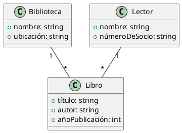
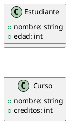
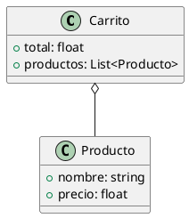
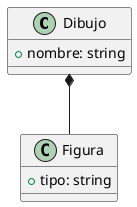
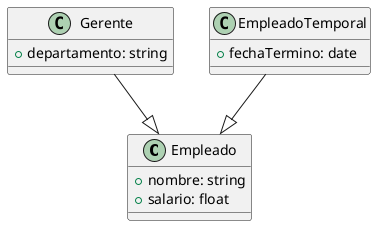
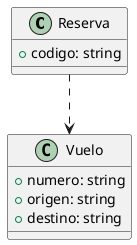

# PlantUML

PlantUML es una herramienta de código abierto que permite generar diagramas UML (Unified Modeling Language) utilizando una sintaxis simple y legible en forma de texto. Con PlantUML, puedes describir la estructura y relaciones entre los elementos de un sistema o proceso y generar automáticamente diagramas UML correspondientes.

Supongamos que queremos representar un sistema de biblioteca con las siguientes clases:

- `Libro`: Representa un libro en la biblioteca con atributos como título, autor y año de publicación.
- `Biblioteca`: Representa la biblioteca con atributos como nombre y ubicación.
- `Lector`: Representa a una persona que es miembro de la biblioteca y puede tomar prestados libros.

Ahora, podemos utilizar la sintaxis de PlantUML para definir estas clases y sus relaciones:

En este ejemplo, hemos definido tres clases (`Libro`, `Biblioteca` y `Lector`) junto con sus atributos. Luego, hemos establecido las relaciones entre estas clases utilizando la sintaxis de PlantUML:

- La relación entre `Biblioteca` y `Libro` indica que una biblioteca puede contener múltiples libros (relación uno a muchos), denotada por `"1" -- "*"`.
- La relación entre `Lector` y `Libro` indica que un lector puede tomar prestados múltiples libros (relación uno a muchos), también denotada por `"1" -- "*"`.

## Marcando relaciones entre clases 

A continuación vamos a ver unos ejemplos detallados para cada tipo de relación en UML, junto con su representación en PlantUML:

1. **Asociación:**
   - Ejemplo: En un sistema de gestión de estudiantes, una clase `Estudiante` puede estar asociada con una clase `Curso` para indicar qué curso está tomando un estudiante.
   - PlantUML:

2. **Agregación:**
   - Ejemplo: En un sistema de compra en línea, una clase `Carrito` puede estar agregada por múltiples instancias de la clase `Producto`.
   - PlantUML:

3. **Composición:**
   - Ejemplo: En un sistema de dibujo, una clase `Dibujo` puede estar compuesta por múltiples instancias de la clase `Figura`, y estas figuras no existen fuera del dibujo.
   - PlantUML:

4. **Generalización (Herencia):**
   - Ejemplo: En un sistema de gestión de empleados, una clase `Empleado` puede ser generalizada por las clases `Gerente` y `EmpleadoTemporal`, que heredan atributos y métodos comunes de la clase `Empleado`.
   - PlantUML:

5. **Dependencia:**
   - Ejemplo: En un sistema de reserva de vuelos, una clase `Reserva` puede depender de la clase `Vuelo` para conocer los detalles del vuelo reservado.
   - PlantUML:

