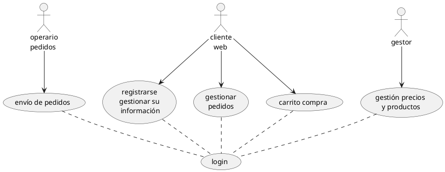
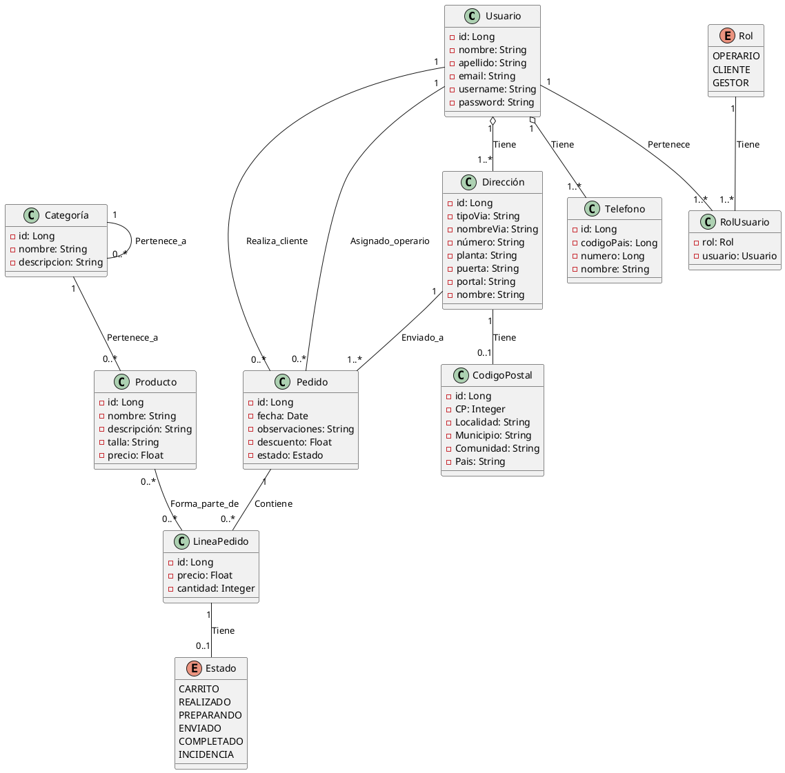
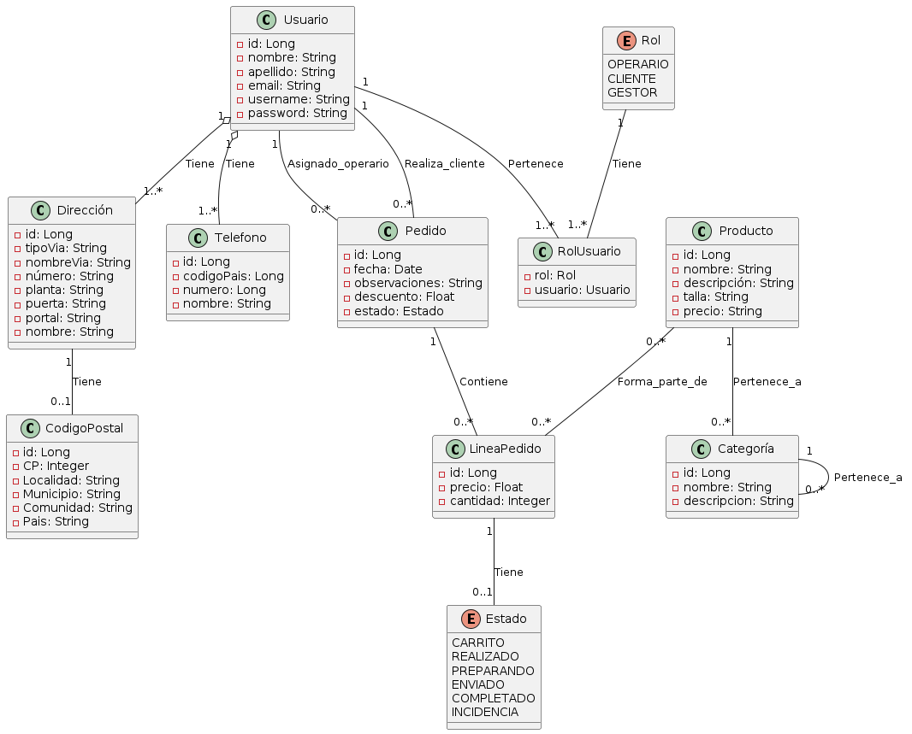

# Análisis

## Diagrama de casos de uso

Un diagrama de casos de uso modela las interacciones entre actores y casos de uso en un sistema, en concreto nosotros tendremos:

- **Actor:** Son las entidades externas que interactúan con el sistema. Necesitamos representar tres actores: Gestor, Operario y Cliente. Cada uno de ellos tiene un rol específico en el sistema.
  
- **Casos de uso:** Son las acciones o funcionalidades que realiza el sistema para satisfacer las necesidades de los actores. En el diagrama necesitamos varios casos de uso identificados, cada uno representado por un rectángulo. Los casos de uso incluyen:
  - `gestión precios y productos`: Relacionado con la gestión de precios y productos en el sistema.
  - `envío de pedidos`: Relacionado con el proceso de envío de pedidos.
  - `registrarse y gestionar su información`: Relacionado con las acciones que realiza un cliente para registrarse en el sistema y gestionar su información personal.
  - `gestionar pedidos`: Relacionado con la gestión de pedidos por parte de un cliente.
  - `carrito compra`: Relacionado con las funcionalidades de un carrito de compra en el sistema.
  - `login`: Relacionado con el proceso de inicio de sesión en el sistema.

- **Relaciones:** Las flechas entre actores y casos de uso representan las interacciones entre ellos. Por ejemplo:
  - El Gestor interactúa con el caso de uso `gestión precios y productos`.
  - El Operario interactúa con el caso de uso `envío de pedidos`.
  - El Cliente interactúa con los casos de uso `registrarse y gestionar su información`, `gestionar pedidos`, `carrito compra` y `login`.

- **Relaciones entre casos de uso:** Las líneas sólidas entre los casos de uso indican relaciones de inclusión o dependencia. En este caso, todos los casos de uso están relacionados con el caso de uso `login`, lo que indica que el proceso de inicio de sesión es necesario para acceder a cualquiera de las funcionalidades del sistema.

Código PlantUML para modelar el caso de uso:

## Diagrama de clases

Para realizar el diagrama de clases vamos a usar de nuevo PlantUML:

Este diagrama de clases en PlantUML describe la estructura de nuestro sistema de gestión de pedidos y productos, donde tenemos las siguientes:

1. **Clases:**
   - `Usuario`: Representa un usuario del sistema con atributos como `id`, `nombre`, `apellido`, `email`, `username` y `password`.
   - `Producto`: Representa un producto con atributos como `id`, `nombre`, `descripción`, `talla` y `precio`.
   - `Pedido`: Representa un pedido realizado por un usuario con atributos como `id`, `fecha`, `observaciones`, `descuento` y `estado`.
   - `LineaPedido`: Representa una línea individual dentro de un pedido con atributos como `id`, `precio`, `cantidad` y una referencia al producto.
   - `Categoría`: Representa una categoría a la que pueden pertenecer los productos, con atributos como `id`, `nombre`, `descripcion` y una referencia opcional al padre de la categoría.
   - `Dirección`: Representa la dirección de un usuario con atributos como `id`, `tipoVia`, `nombreVia`, `número`, `planta`, `puerta`, `portal`, `nombre` y referencias opcionales al código postal y al usuario propietario.
   - `Telefono`: Representa un teléfono asociado a un usuario con atributos como `id`, `codigoPais`, `numero`, `nombre` y una referencia al usuario propietario.
   - `Rol`: Enumeración que define los roles posibles de los usuarios: `OPERARIO`, `CLIENTE` y `GESTOR`.
   - `RolUsuario`: Relaciona un usuario con su rol correspondiente.

2. **Relaciones:**
   - `Usuario` tiene una relación de uno a muchos con `Pedido`, indicando que un usuario puede realizar varios pedidos.
   - `Usuario` también tiene relaciones uno a uno con `Dirección` y `Telefono`, indicando que un usuario puede tener una dirección y varios teléfonos.
   - `Usuario` tiene una relación de uno a muchos con `RolUsuario`, lo que significa que un usuario puede tener varios roles en el sistema.
   - `Rol` tiene una relación uno a uno con `RolUsuario`, lo que significa que un rol está asociado a un único usuario.
   - `Pedido` tiene una relación de uno a muchos con `LineaPedido`, lo que significa que un pedido puede contener múltiples líneas de pedido.
   - `Pedido` también tiene una relación de muchos a uno con `Usuario`, indicando que un pedido puede tener un usuario asignado como operario.
   - `Producto` tiene una relación de muchos a muchos con `LineaPedido`, lo que significa que un producto puede estar presente en varias líneas de pedidos y una línea de pedido puede contener varios productos.
   - `Categoría` tiene una relación de uno a muchos con `Producto`, lo que significa que una categoría puede contener múltiples productos.
   - `Categoría` tiene una relación de uno a muchos consigo misma, lo que indica que una categoría puede tener subcategorías.
   - `Dirección` tiene una relación opcional de uno a uno con `CodigoPostal`, lo que indica que una dirección puede tener asociado un código postal.
   - `LineaPedido` tiene una relación opcional de uno a uno con `Estado`, lo que indica que una línea de pedido puede tener un estado asociado.

Este diagrama describe la estructura del sistema de gestión de pedidos y productos, así como las relaciones entre las diferentes entidades que componen el sistema. A continuación vemos una representación gráfica del mismo (si tienes en VS Code el fichero `.puml` con el código anterior y pulsas ALT+d se genera esto):

\pagebreak

