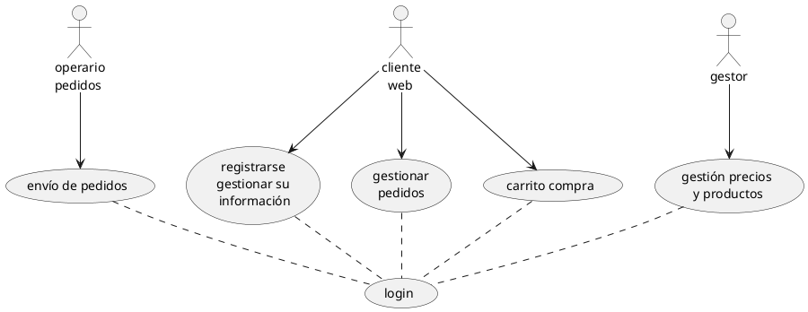
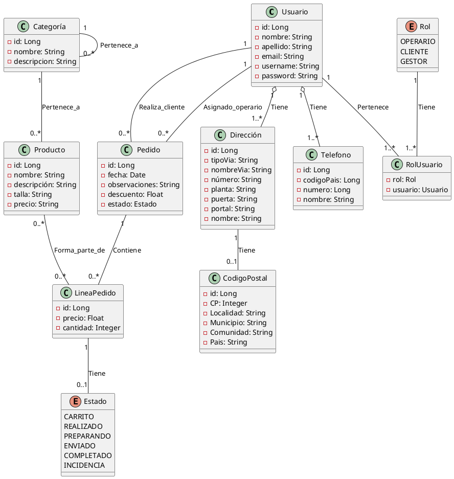

# Análisis

## Diagrama de casos de uso

```plantuml
@startuml Diagrama de casos de uso

usecase (gestión precios\n y productos) as Proc01
actor :gestor: as Gestor
Gestor --> Proc01

usecase (envío de pedidos) as Proc02
actor : operario \n pedidos : as Operario
Operario --> Proc02

usecase ( registrarse \n gestionar su \n información) as Proc03
usecase (gestionar\n pedidos ) as Proc04
usecase (carrito compra) as Proc05
actor : cliente \n   web : as Cliente
Cliente --> Proc03
Cliente --> Proc04
Cliente --> Proc05

usecase ( login ) as Proc06

Proc01 .. Proc06
Proc02 .. Proc06
Proc03 .. Proc06
Proc04 .. Proc06
Proc05 .. Proc06

@enduml
```

## Diagrama de clases

```plantuml

@startuml

class Usuario {
    - id: Long
    - nombre: String
    - apellido: String
    - email: String
    - username: String
    - password: String
}

class Producto {
    - id: Long
    - nombre: String
    - descripción: String
    - talla: String
    - precio: String
}


class Pedido {
    - id: Long
    - fecha: Date
    - observaciones: String
    - descuento: Float
    - estado: Estado
}

enum Estado {
    CARRITO
    REALIZADO
    PREPARANDO
    ENVIADO
    COMPLETADO
    INCIDENCIA
}

class LineaPedido {
    - id: Long
    - precio: Float
    - cantidad: Integer
    ' - producto: Producto
}

class Categoría {
    - id: Long
    - nombre: String
    - descripcion: String
    ' - padre: Categoría
}

class Dirección {
    - id: Long
    - tipoVia: String
    - nombreVia: String
    - número: String
    - planta: String
    - puerta: String
    - portal: String
    - nombre: String
    ' - codpos: CodigoPostal
    ' - usuario: Usuario
}

class Telefono {
    - id: Long
    - codigoPais: Long
    - numero: Long
    - nombre: String
    ' - usuario: Usuario
}

enum Rol {
    OPERARIO
    CLIENTE
    GESTOR
}

class RolUsuario {
    - rol: Rol
    - usuario: Usuario
}

class CodigoPostal {
    - id: Long
    - CP: Integer
    - Localidad: String
    - Municipio: String
    - Comunidad: String
    - Pais: String
}

Usuario "1" -- "0..*" Pedido : Realiza_cliente
Usuario "1" o-- "1..*" Dirección : Tiene
Usuario "1" o-- "1..*" Telefono : Tiene
Usuario "1" -- "1..*" RolUsuario : Pertenece
Rol "1" -- "1..*" RolUsuario: Tiene

Pedido "1" -- "0..*" LineaPedido : Contiene
Pedido "0..*" -- "1" Usuario : Asignado_operario

Producto "0..*" -- "0..*" LineaPedido : Forma_parte_de
Categoría "1" -- "0..*" Producto : Pertenece_a

Categoría "1" -- "0..*" Categoría : Pertenece_a

Dirección "1" -- "0..1" CodigoPostal : Tiene
LineaPedido "1" -- "0..1" Estado: Tiene


@enduml
```

\pagebreak

