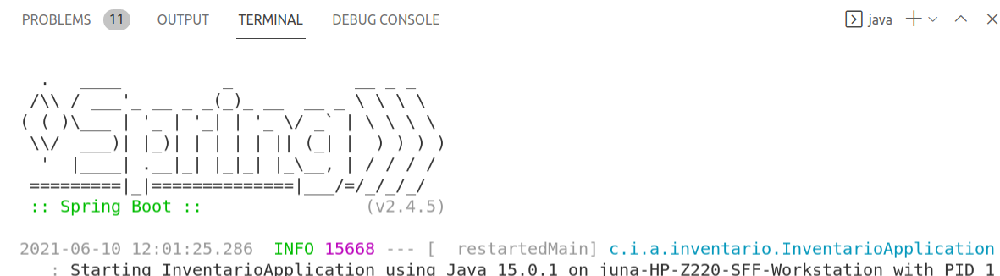
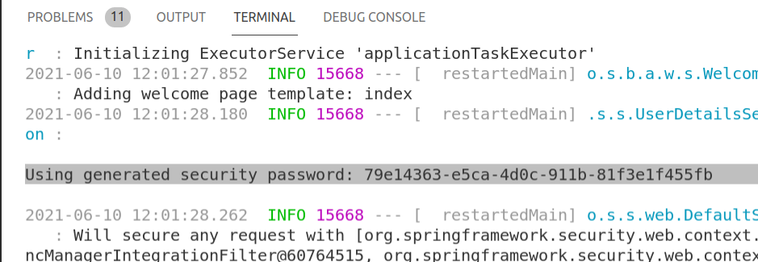

# Spring Security

Por defecto Spring incorpora su propio sistema de login que está habilitado simplemente al añadir la dependencia en el pom.xml.

El usuario por defecto es **user** y la contraseña la puedes ver diferente y generada en cada arranque de la aplicación:



Así aparece el password:



### Spring Security

Las contraseñas deberán estar cifradas con BCRYPT, puedes usar este ejemplo para hacer pruebas:

Plaint text password | Hashed Password
---------------------|----------------
Secreto_123 | $2a$10$PMDCjYqXJxGsVlnve1t9Jug2DkDDckvUDl8.vF4Dc6yg0FMjovsXO


Para dar seguridad a la aplicación podemos crear una clase de configuración donde inyectamos los *beans* encargados de la seguridad. Además sería recomendable crear nuestros formularios de login y actualización de nuestros datos.

Ejemplo de Bean de configuración (puede ser código o un archivo XML):

```java
@Configuration
public class SecurityConfiguration {

    @Autowired
    DataSource dataSource;

    @Autowired
    public void configure(AuthenticationManagerBuilder auth) throws Exception {
        auth.jdbcAuthentication()
                .dataSource(dataSource)
                .usersByUsernameQuery(
                    "select username, password, enabled " +
                    "from usuario where username = ? ")
                .authoritiesByUsernameQuery(
                    "select u.username, ur.authority " +
                    "from usuario u, usuario_rol ur where u.id=ur.usuario_id and u.username = ? ");
    }

    @Bean
    public BCryptPasswordEncoder passwordEncoder() {        
        return new BCryptPasswordEncoder();
    }

    @Bean
    public SecurityFilterChain filterChain(HttpSecurity http) throws Exception {

        http.httpBasic().and().authorizeHttpRequests().anyRequest().authenticated()
            .and().csrf().disable().cors().and()
            .formLogin().and()
            .logout()
            .logoutUrl("/logout")
            .invalidateHttpSession(true)
            .deleteCookies("JSESSIONID");
        

        return http.build();
    }

    @Bean
    public WebSecurityCustomizer webSecurityCustomizer() {
        return (web) -> web.ignoring().requestMatchers("/images/**", "/js/**", "/webjars/**");
    }

}

```

Ejemplo de controlador para gestionar el CRUD de los usuarios del sistema con el usuario administrador:

```java
@RestController
@RequestMapping("/admin")
public class ServiUsuario {
    @Autowired
    RepoUsuario repoUsuario;
    @Autowired
    RepoUsuarioRol repoUsuarioRol;

    @GetMapping("usuario")
    List<Usuario> findAll(){
        return repoUsuario.findAll();
    }

    @GetMapping("usuario/{id}")
    Usuario findById(@PathVariable (value = "id") Integer id){
        return repoUsuario.findById(id).get();
    }

    @PostMapping("usuario")
    Usuario create(@RequestBody Usuario u){
        String passwdPlano = u.getPassword();
        BCryptPasswordEncoder bpe = new BCryptPasswordEncoder();
        u.setPassword(bpe.encode(passwdPlano));
        Usuario user = repoUsuario.save(u);
        UsuarioRol ur = new UsuarioRol();
        ur.setAuthority("ROLE_USER");
        ur.setUsuario(u);
        repoUsuarioRol.save(ur);
        return user;
    }

    @DeleteMapping("usuario/{id}")
    void delete(@PathVariable (value = "id") Integer id){
        repoUsuario.deleteById(id);
    }
}

```

\pagebreak

